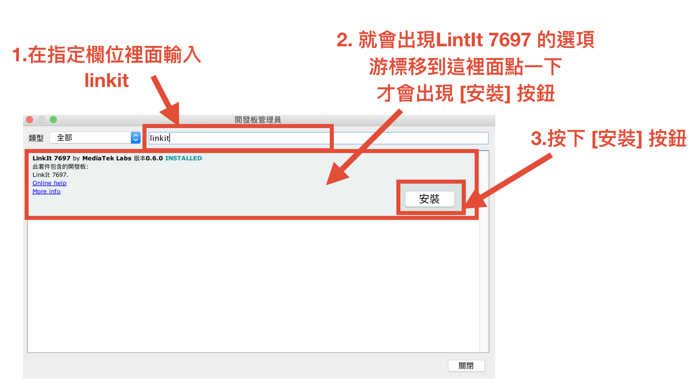
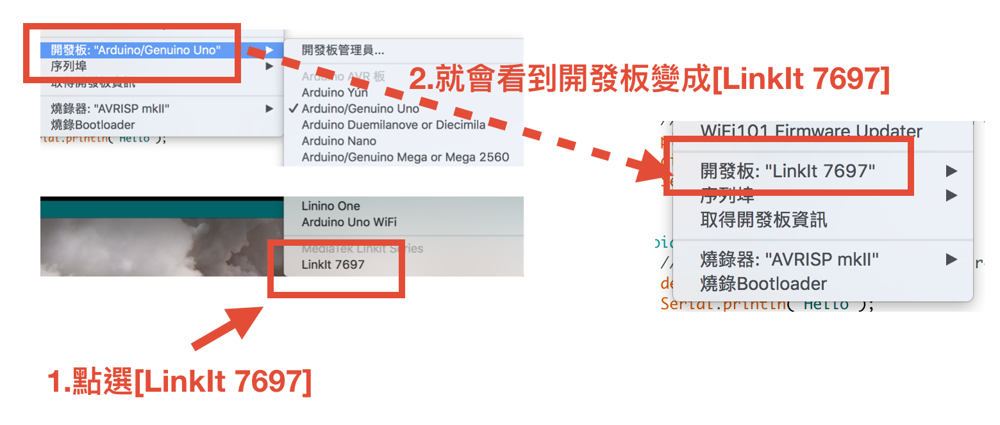
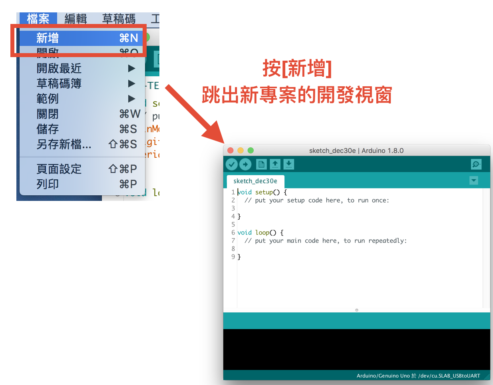
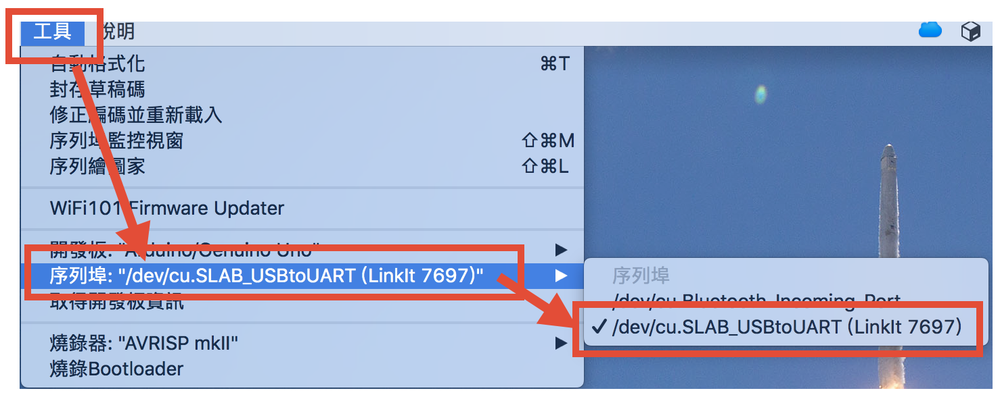
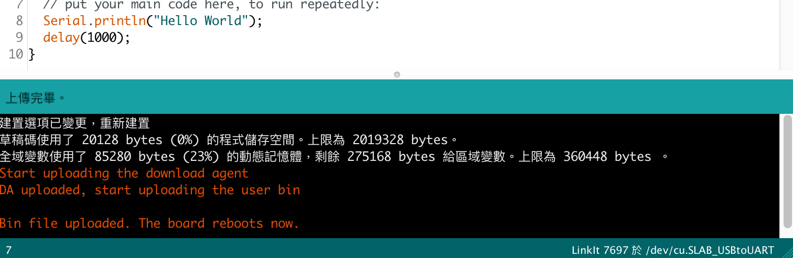
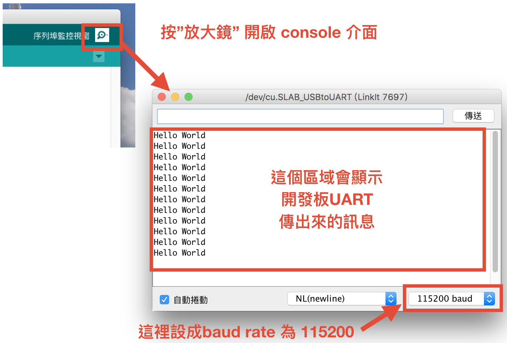
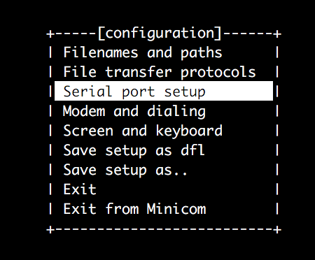
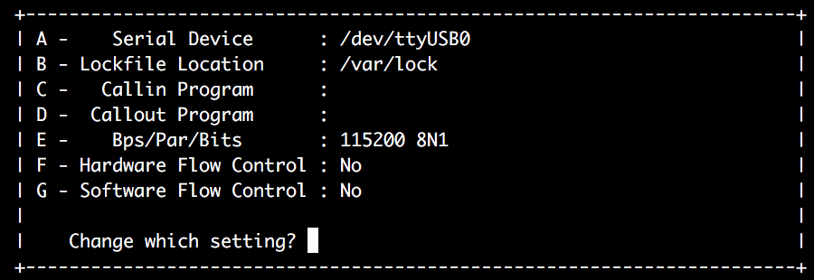
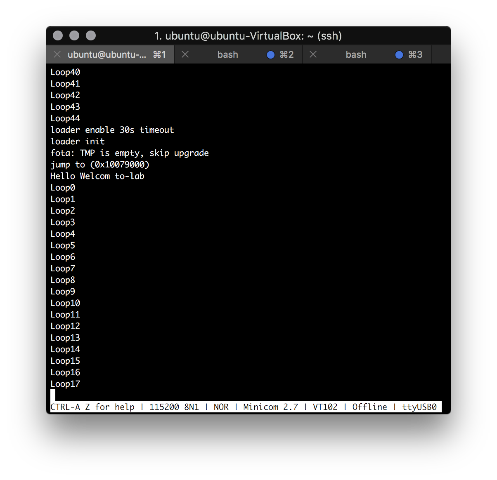

# Hello World 訊息--顯示Log訊息(mini com)

教導如用使用mini com作為開發除錯工具，第一步將教導如先用Arduino IDE
寫一個Hello World程式燒錄至MT7697上，讓mini com將Log訊息顯示在終端機上。

## MT7697 Arduino IDE 開發

MT7697 有提供 Arduino IDE 的開發環境，在 Linux (ubuntu14.04) 上建立
開發環境之前，可以先裝來用看看。因為 Arduino IDE 提供陽春易用開發介面
與好用 console 工具，可以幫助初學者降低學習門檻。

Arduino IDE 是一個免費的應用程式APP，請直接到下面的 Arduino 官網下載。

    https://www.arduino.cc/en/Main/Software

如下圖所示。打開Arduino的`Preferences` 的設定頁面，然後將下面這行文字
複製貼上到標示為 `額外的開發板管理員網址` 的文字輸入格裡面。然後按確定。

    http://download.labs.mediatek.com/package_mtk_linkit_7697_index.json


然後參考照下圖的方式點選來開啟開發板管理員管理介面


參考下圖的方式，在欄位裡輸入 `linkit` ，找到 LinkIt 7697 的項目並安裝



然後就可以照下圖的方式，將開發板設定變為 LinkIt 7697。



設定到這裡之後，在 Arduino IDE 上面的程式碼才可以編譯與上傳到MT7697開發板。


### 顯示 Hello World 訊息

安裝 Arduino IDE 並設定開發板為 LinkIt 7697 之後，就可以開始開寫程式上傳到
MT7697 的板子上面執行了。

第一步，參考下圖，新增一個新的專案。




接下來開始寫程式吧，如下圖寫個範例程式碼。按下 "勾勾" 按鈕確認程式碼可以成功
編譯之後，就把 LinkIt 7697 開發板接上電腦。


當開發板接上電腦之後，參考下圖，指定按 "箭頭" 之後程式碼要上傳的開發板。
指定完成之後，就照上圖的方式，按下 "箭頭" 開始進行上傳程式碼到開發板的動作。



如果看到下圖的訊息，就表示說程式碼上傳成功了。



程式碼上傳完成後開發板會自動重啟並開始執行程式碼，這個時候參考下圖，打開
console介面、設定 baud rate，應該可以看見 "Hello World" 會以每秒一個的頻率跳出來。



不過在Linux環境底下一般在顯示這樣的訊息的時候，會使用 "minicom" 指令配合其他手法
來顯示 log 訊息來進行 debug 的動作。所以確定板子會固定顯示訊息之後，下面開始介紹
如何使用 "minicom" 來顯示訊息。


## Minicom

Minicom是一個基於文本的串口通訊程序。它用於與外部RS-232設備（如手機，路由器和串行控制台端口）通信。

### 安裝minicom
在Linux開啟終端機輸入下列指令就可以安裝Linux
```
sudo apt-get install minicom
```

### 查尋device port
當usb插上Linux將/dev 將產生一個node，將會命為/dev/USBx(x為數字序號),可以從下demsg查尋。

```
sudo demsg
```
此時終端機將會輸出約如下畫面，注意他與usb連接為ttyUSB0
```
[  242.618254] usb 2-2: SerialNumber: 0001
[  243.662352] usbcore: registered new interface driver usbserial
[  243.662591] usbcore: registered new interface driver usbserial_generic
[  243.662661] usbserial: USB Serial support registered for generic
[  243.665093] usbcore: registered new interface driver cp210x
[  243.665198] usbserial: USB Serial support registered for cp210x
[  243.665216] cp210x 2-2:1.0: cp210x converter detected
[  243.697994] usb 2-2: cp210x converter now attached to ttyUSB0
```

由上文可以看Linux系統配ttyUSB0給MT7697。我們將需要使用Minicom與USB0連接。接下來，進入終端輸入：
```
sudo minicom -s
```


選擇Serial port setup，將會開啟如下

- Serial Device:為uart port，輸入MT7697連接至作業系統給於埠
- Bps:Baud rate一般典型的是300, 1200, 2400, 9600, 19200, 115200等
- Hardware Flow:設為No

設定完按下Enter離開。
在終端機上輸入
```
sudo minicom
```
結果如下圖

