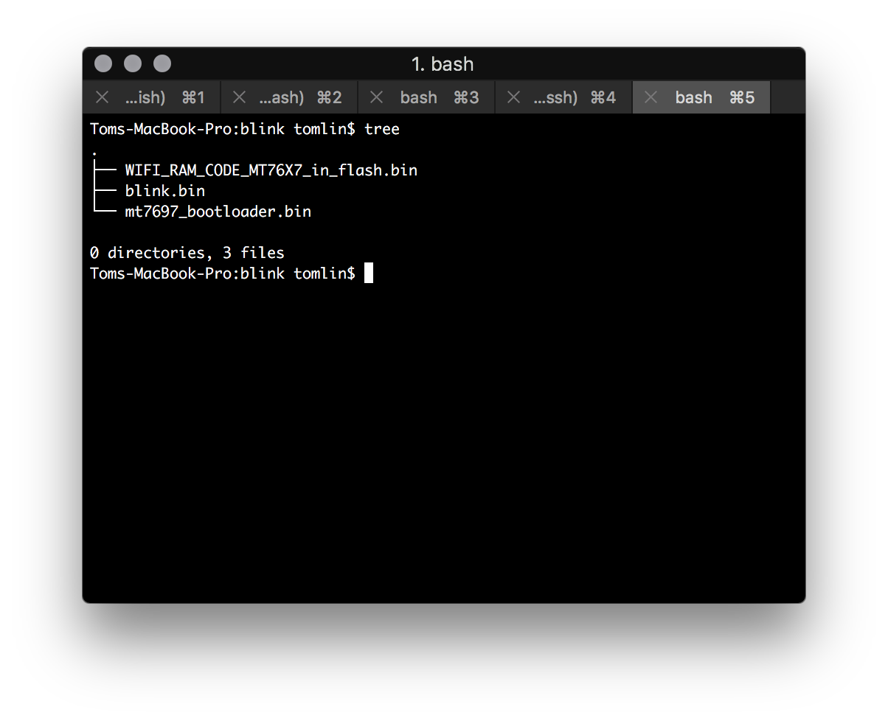
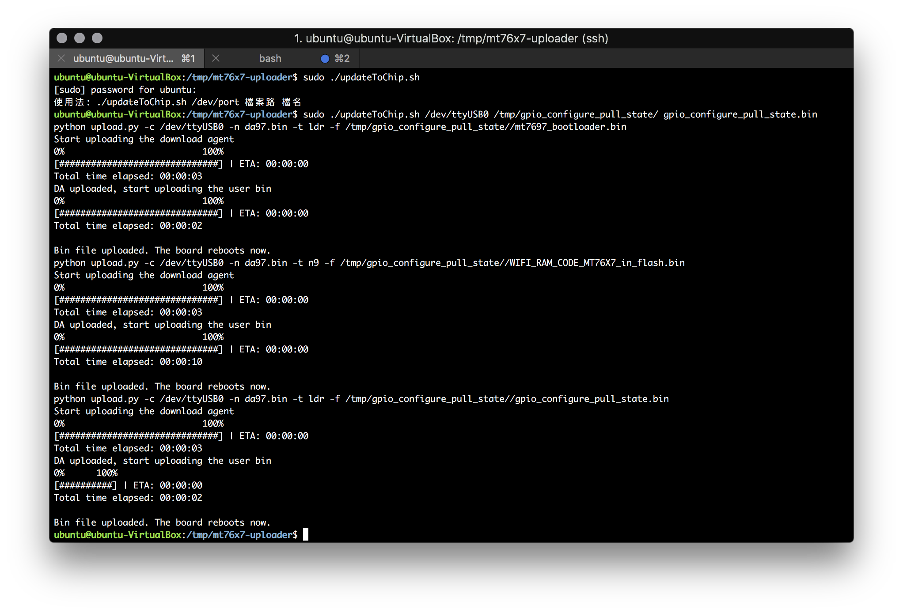

# ----

## Upload 燒錄程式到 MT76x7

這是一個工具是由MTK所提供燒錄工具在Linux與macOS可以才用Python進行燒錄，此項工具提供了功能是對於Flash bootloader與韌體裡的CM4與N9裡行燒入與各自專案的完成產生的bin檔(二進檔).

### 環境與支援平台

- 作業系統需要有Python 2.7
- 適用硬體為MT7687或MT7697

### 下載燒錄工具
```
git clone https://github.com/MediaTek-Labs/mt76x7-uploader.git
```

### 指令使用

使用指令選項:
- -c com_port:串列埠 在Linux系統 /dev/tty.USBx(x:為作業系統產生號碼)
- -f BIN_FILE:這是要被燒錄至晶片的二進制檔的檔名
- -n DA_FILE:為MT7687與MT7697所需要的燒錄的時資料檔，da87.bin用於MT7687與da97.bin 用於MT7697
- -t FLASH_TARGET:程式燒錄至晶片空間位置，主要分為3個區塊cm4、ldr、n9

使用方式:
```
python ./upload.py -c /dev/ttyUSB0 -f your_sample.bin -t cm4 -p mt7697
```

在本章範例提供閃爍LED的二進檔如下圖

- WIFI_RAM_CODE_MT76X7_in_flash.bin:為晶片wifi設定
- blink.bin 上一個章節所編譯出來二進制檔
- mt7697_bootloader.bin: mt7697的bootloader

可以通過upload.py將二進制檔燒錄至晶片組
```
python upload.py -c /dev/ttyUSB0 -n da97.bin -t ldr -f mt7697_bootloader.bin
python upload.py -c /dev/ttyUSB0 -n da97.bin -t n9 -f WIFI_RAM_CODE_MT76X7_in_flash.bin
python upload.py -c /dev/ttyUSB0 -n da97.bin -t cm4 -f blink.bin
```
我將簡化了此流程，提供腳本程式:updateToChip.sh
```

#!/bin/bash
if [  $# -ne 3 ]; then
        echo "使用法: ./updateToChip.sh /dev/port 檔案路 檔名"
        exit
fi
devices=$1
filePath=$2
fileName=$3
echo "python upload.py -c $devices -n da97.bin -t ldr -f $filePath/mt7697_bootloader.bin"
python upload.py -c $devices -n da97.bin -t ldr -f $filePath/mt7697_bootloader.bin
echo "python upload.py -c $devices -n da97.bin -t n9 -f $filePath/WIFI_RAM_CODE_MT76X7_in_flash.bin"
python upload.py -c $devices -n da97.bin -t n9 -f $filePath/WIFI_RAM_CODE_MT76X7_in_flash.bin
echo "python upload.py -c $devices -n da97.bin -t ldr -f $filePath/$fileName"
python upload.py -c $devices -n da97.bin -t ldr -f $filePath/$fileName
```

使用方式sudo ./updateToChip.sh uart的路徑 檔案路 檔名
```
sudo ./updateToChip.sh /dev/ttyUSB0 /tmp/gpio_configure_pull_state/  gpio_configure_pull_state.bi

```
其動作將會如下圖

