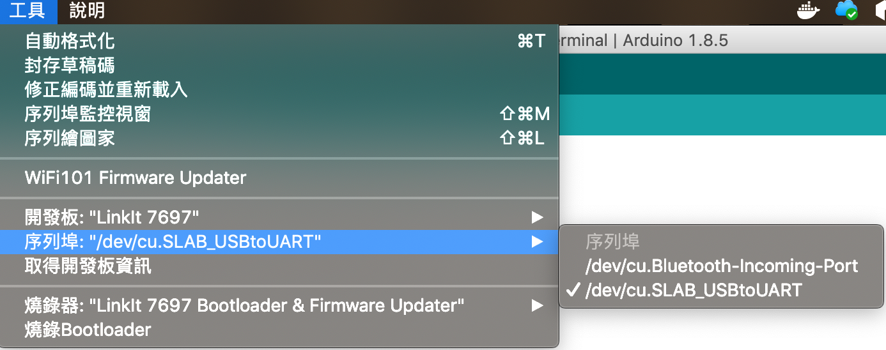
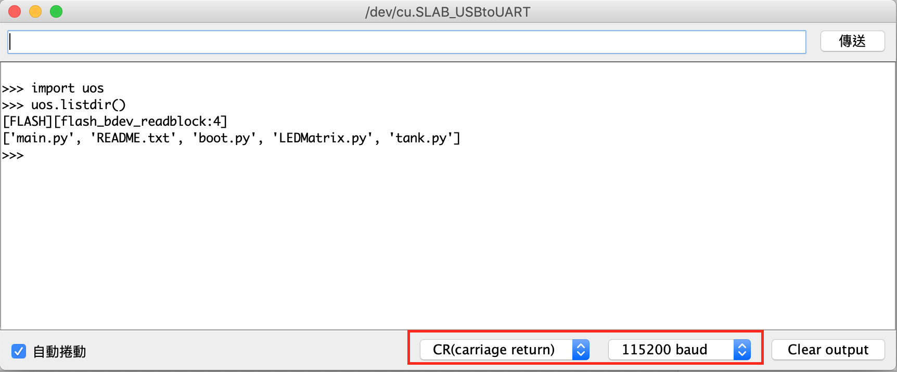

# USB 線連接

## Arduino 

使用 USB 和 linkit 7697 連接上之後，可使用 Arduino IDE 與其
進行連線

   

開啟 Arduino 序列埠設定為 `115200 baudrate` ，結束符號為 `CR`。

   

# machine 模組

- Pin
- PWM
- SPI
- I2C

## Pin Input/Output 功能

Usage 

    Pin(pinNum [, mode ][,pull])
	pinNum : pin 腳號碼
	mode : Pin.OUT (輸出) 或 Pin.IN (輸入)(預設)
	pull : Pin.PULL_UP (上拉電阻)或 Pin.PULL_DOWN(下拉電阻), 或 Pin.PULL_DISABLE (無上下拉電阻,預設)

Input ex:

    >>> from machine import Pin
	>>> p6 = Pin(6,Pin.IN)
	>>> print(p6.value())
	>>> print(p6())

Output ex:

    >>> from machine import Pin
	>>> p7 = Pin(7,Pin.OUT)
	>>> p7.value(1)
	>>> p7.value(0)
	>>> p7.toggle()
	>>> p7(1)
	>>> p7(0)

## PWM 功能

    PWM(pinNum, freq [,duty])
	freq (PWM頻率Hz) : 400 ~ 19000
	duty (PWM duty ) : 0 ~ 1023

產生 PWM 物件

	from machine import PWM
	pwm7 = PWM(7, freq=1000, duty=1023)
	pwm7 = PWM(7, 1000, 1023)
	pwm7 = PWM(7, 1000)

取得 PWM 頻率

	pwm7.freq()

設定 PWM 頻率

    pwm7.freq(15000)

取得 PWM duty

    pwm7.duty()

設定 PWM duty

	pwm7.duty(1023)

## SPI Master

	spi = SPI(mosi,miso,sck)
	mosi : 做為 SPI MOSI 的 pin 腳號碼
	miso : 做為 SPI MISO 的 pin 腳號碼
	sck  : 做為 SPI SCK  的 pin 腳號碼

使用上注意，還需自行產生一個 SPI CS 的 pin 

產生 SPI 物件和一個 CS Pin 物件

    from machine import SPI
    from machine import Pin

	cs = Pin(10, Pin.OUT)
	spi = SPI(mosi=11,miso=12,sck=13)

SPI 寫入資料

    spi.write(data)
	data : 要傳送過去的資料，以 bytes 或 bytearray 的形式

    data = bytes((1,2,3,4))
	cs.value(0)
    spi.write(data)
	cs.value(1)

SPI 讀取資料
    
	data = spi.read(nbytes)
	nbytes : 要取讀的 byte 數
	data : 回傳的資料，以 bytes 的形式

    cs.value(0)
	data = spi.read(9)
    cs.value(1)

## I2C Master

    P8 : I2C SCL
    P9 : I2C SDA

	I2C(id, scl, cda[, freq][, timeout])
	id: -1 以下的值，表示使用軟體模擬 i2c
	    0 以上的值，表示使用硬體 i2c (目前不支援)
	scl : 用來當做 SCL 用的 Pin 物件
	sda : 用來當做 SDA 用的 Pin 物件
	freq : i2c 傳輸頻率，預設 40,000 Hz
	timeout : 無回應 timeout 時間

需先產生兩個Pin物件做為 SDA SCL

	p8 = Pin(8)
	p9 = Pin(9)

再產生 i2c 物件

    i2c = I2C(-1, scl = p8, sda = p9, freq = 40000)
    i2c = I2C(-1, p8, p9, freq = 40000, timeout = 255)
    i2c = I2C(-1, p8, p9)

i2c 掃描 bus 上所有的 i2c slave 裝置

	i2c.scan()

i2c 讀取資料

	i2c.readfrom(addr, nbytes,[stop = True])

	addr : i2c 裝置的位置
	nbytes : 要讀取的 byte 數
	stop : 該動作做完是否要送出 stop condition 以結束整個傳輸過程

ex: 

	i2c.readfrom(60, 9)

i2c 寫入資料

	i2c.writeto(addr, buff, stop = True)

	addr : i2c 裝置的位置
	buff : 要寫入的資料，以 bytearray 形式傳入
	stop : 該動作做完是否要送出 stop condition 以結束整個傳輸過程

ex:

	data = bytearray((1, 2, 3, 4, 5))
	i2c.writeto(60, data)

讀寫複合動作

	i2c.writeto(60, bytearray((1, 2, 3)), stop = False)
	i2c.readfrom(60, 9)

# uos 模組

    import uos

看當下目錄有哪些檔案

    uos.listdir()

建立資料夾

    uos.mkdir('data')

刪除資料夾

    uos.rmdir('data')

將暫存資料同步到磁碟中

    uos.sync()

刪除檔案

    uos.remove('filename.txt')

產生指定長度的隨機 bytes

    uos.urandom(10)

取得目前的路徑

    uos.getcwd()

取得目前版本訊息

    uos.uname()

取得指定路徑的 file system 狀態訊息

    uos.statvfs('/flash')

