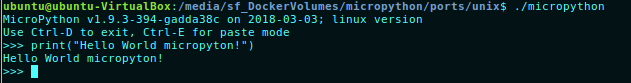

### 第二篇 MicroPython
MicoPython啟初由澳洲程式工程師兼物理家 Damien George在2013在Kickstarter成功募資創建，雖然當初的MicroPython，只支援Pyboard 微控制器(STM32)，由於Micropython支援基於ARM架構，MicroPython已經可以運行在Arduino、ESP8266、ESP32等硬體上。

MicroPython 是用C語言編寫的Python 3程式語言軟體實現，它擁有是一個完整的Python編譯器與運行庫，並且經過優化過可以執行於微控制晶片。使用者可以使用交互式提示(REPL)，立即執行被支援的指命。包括一系列核心Python函式庫、模組庫。MicroPython也包含可以讓使用者可以直接的讀寫低層硬體。

在MicoPython主要組成資料夾
- py/ -- Python核心實現，包含編譯器，運行時和核心函庫。
- mpy-corss/ -- MicroPython跨平台編譯器，用於將腳本轉換為預編譯的字節碼。
ports/unix/ -- MicroPython可以執行於Unix
- ports/stm32/ -- MicroPython執行於STM32系列板上
ports/minmal -- 一個最小的MicroPython端口，如果你想將MicroPython移植到另一個控制器，請從此開始
- tests/ -- 測試架構與測試腳本
- docs/ -- 使用者的文件

另外組成資料夾
- ports/bare-arm/ -- 適用於ARM MCU的MicroPython最低版本。主要用於控制代碼大小。
- ports/teensy/ -- 執行於Teensy 3.1運行MicroPythton。
- ports/pic16bit/ -- 執行於16-bits PIC 微控制器。
- ports/cc3200/ -- 執行於TI的CC3200 MCU
- ports/esp8366/ -- 執行於ESP8266 wifi模組
- extmod/ -- 附加的模組用C實作。
- tools/ -- 各種工具，包括 pyboard.py模組。
- examples/ -- 少數Python腳本範例。

### The Unix Version
在 **port/unix** 編譯時需要一個Unix or Unix-Like可以操作gcc 和GNU make的環境，其硬體可為x86、x64、ARM或MIPS。全功能轉換其他的架構所需要編寫組合語言用於另外事件處理和程式垃圾收集。或者，可以使用setjmp/longjmp為基礎實做fallback。

開始下載microPython
```
git clone https://github.com/micropython/micropython.git
```
下載submodule、初始化、編譯axtls / microPython for Unix
```
cd micropython
git submodule update --init
cd port/axls
make axtls
make
```

編譯完成後，開始執行micropython
```
./microython
```

