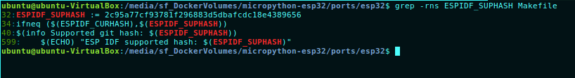

### MicroPython for the ESP32
ESP32整合Wi-Fi(2.4GHz band)和Bluetooth4.2在同一個晶片上，隨著雙核處理核心與低功協處理器等內建功能，EPS32提供了強有力、高度整合平台，可持續符合高效用電需求、嚴謹設計、安全性、高效率感或可靠性。

Espressif 提供了基本硬體與軟體資源，它幫助應用EPS32硬體系列開發應用程式軟體。可用WiFi, Bluetooth通訊方式與幾個其他特性，經Espressif可以在軟體開發架構上快速開發IOT應用。

### 建置EPS32編譯程式環境
1. Ubuntu and Debian相關開發套件安裝
```
sudo apt-get install git wget make libncurses-dev flex bison gperf python python-serial
```
2. ubuntu 16.04之前
```
sudo apt-get install gawk gperf grep gettext libncurses-dev python python-dev automake bison flex texinfo help2man libtool
```
3. ubuntu 16.04
```
sudo apt-get install gawk gperf grep gettext python python-dev automake bison flex texinfo help2man libtool libtool-bin
```
Espressif 下載適用Linux:
  - 64位元
```
https://dl.espressif.com/dl/xtensa-esp32-elf-linux64-1.22.0-80-g6c4433a-5.2.0.tar.gz
```
  - 32位元
```
https://dl.espressif.com/dl/xtensa-esp32-elf-linux32-1.22.0-80-g6c4433a-5.2.0.tar.gz
```


4. 依照你電腦位元數下載檔案至~/bin/esp
```
mkdir -p bin/esp
cd ~/bin/esp
wget https://dl.espressif.com/dl/xtensa-esp32-elf-linux64-1.22.0-80-g6c4433a-5.2.0.tar.gz
tar -xvf xtensa-esp32-elf-linux64-1.22.0-80-g6c4433a-5.2.0.tar.gz
```
5. 將更新.profile 將xtensa-esp32-elf設立環境變數，並且使得xtensa-eps32-elf可以適用於所有終端機上。
```
if [ -d "$HOME/bin/esp" ]; then
   PATH="$PATH:$HOME/bin/esp/xtensa-esp32-elf/bin"
   export PATH
fi
```
6. 下載ESP32所需要特別的API/函式庫
```
cd ~/bin/esp/
git clone --recursive https://github.com/espressif/esp-idf.git
cd esp-idf/
git submodule update --init
```
7. 將IDF_PATH加入Profile
```
if [ -d "$HOME/bin/esp/esp-idf" ]; then
   export IDF_PATH=\$HOME/bin/esp/esp-idf
fi
 ```

8. ESP-IDF進版快速但是MicroPython只支持某個版本，該版本的git hash可以通在沒有配置情況下運make來找到'ESPIDF'。

9. 請至MicroPython/ports/eps32找尋所需要的hash值
````
cd MicroPytho/ports/eps32
grep -rns ESPIDF_SUPHASH Makefile
````

````
cd ~/bin/esp/esp-elf/
git checkout -b support_micropython 2c95a77cf93781f296883d5dbafcdc18e4389656
git submodule update --recursive
````
7. espressif ESP-IDF指只為Python2安裝pyserial，所以如果Python 3或非系統的Python，需要另外安裝pyserial(或esptool)
````bash
pip install pyserial
````
8. 需要設定"ESPIDF"的makefile變量指向，可以在cd MicroPytho/ports/eps32/Maikefile增加於文件裡
```
ESPIDF = $(IDF_PATH)
PORT ?= /dev/ttyUSB0
BAUD ?= 460800
FLASH_MODE ?= dio
FLASH_FREQ ?= 40m
FLASH_SIZE ?= 4MB
CROSS_COMPILE ?= xtensa-esp32-elf-
```
9. 必須建立crosss-compiler預先編譯內建腳本節碼。
```bash
cd MicroPytho
make -C mpy-cross
```
10. ESP32相依於Berkeley DB,這是一個外部的依賴（git子模塊）。 你需要讓git初始化它模塊使用以下命令：
````bash
$ git submodule init lib/berkeley-db-1.xx
$ git submodule update
````

11. 建立適用ESP32的MicroPython.
````bash
cd MicroPytho/ports/eps32
make
````
這會在build子目錄生成二進制firmware 鏡像(其中:bootloader.bin、paritions.bin與application.bin)
你將需要有用戶權限能訪問/dev/ttyUSB0，你可以加入你使用者權限到'dialout'群組，並且重新啟動
```bash
sudo adduer <username> dialout
```
