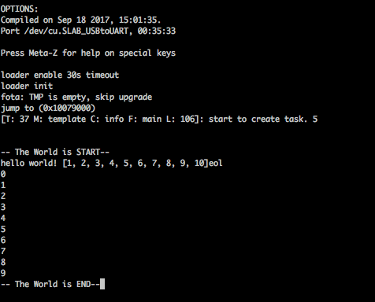

# Build Micropython 專案
上節將MT7697編輯環境建立完成，現在我們將MT7697上編輯一個可以執行MicroPython程式。
這時我們可以參考MicroPython裡的**minimal**與**stm32**專案為建制範本。
```sh
cd (MicoPython_SDK_PATH)
cp ports/minimal/mpconfigport.h port/mt7697/GCC/
cp prots/minmal/frozentest.mpy prot/mt7697/GCC/
cp ports/minial/frozentest.py port/mt7697/GCC/
cp ports/minial/mphalport.h port/mt7697/inc/mphalport.h
cp prots/minial/qstrdefsport.h port/mt7697/inc/qstrdefsport.h
cp ports/stm32

```

- 修改mpconfigport.h
    ```diff
    --- .//ports/minimal/mpconfigport.h	2018-04-08 15:28:34.000000000 +0800
    +++ .//ports/mt7697/GCC/mpconfigport.h	2018-04-08 15:28:34.000000000 +0800
    @@ -7,22 +7,25 @@
     // will still be able to execute pre-compiled scripts, compiled with mpy-cross.
     #define MICROPY_ENABLE_COMPILER     (1)

    +#define MICROPY_KBD_EXCEPTION       (1)
     #define MICROPY_QSTR_BYTES_IN_HASH  (1)
     #define MICROPY_QSTR_EXTRA_POOL     mp_qstr_frozen_const_pool
    -#define MICROPY_ALLOC_PATH_MAX      (256)
    -#define MICROPY_ALLOC_PARSE_CHUNK_INIT (16)
    +#define MICROPY_ALLOC_PATH_MAX      (128)
    +#define MICROPY_ALLOC_PARSE_CHUNK_INIT (128)
     #define MICROPY_EMIT_X64            (0)
    -#define MICROPY_EMIT_THUMB          (0)
    -#define MICROPY_EMIT_INLINE_THUMB   (0)
    -#define MICROPY_COMP_MODULE_CONST   (0)
    +#define MICROPY_EMIT_THUMB          (1)
    +#define MICROPY_EMIT_INLINE_THUMB   (1)
    +
    +#define MICROPY_COMP_MODULE_CONST   (1)
     #define MICROPY_COMP_CONST          (0)
     #define MICROPY_COMP_DOUBLE_TUPLE_ASSIGN (0)
    -#define MICROPY_COMP_TRIPLE_TUPLE_ASSIGN (0)
    +#define MICROPY_COMP_TRIPLE_TUPLE_ASSIGN (1)
    +
     #define MICROPY_MEM_STATS           (0)
     #define MICROPY_DEBUG_PRINTERS      (0)
     #define MICROPY_ENABLE_GC           (1)
     #define MICROPY_GC_ALLOC_THRESHOLD  (0)
    -#define MICROPY_REPL_EVENT_DRIVEN   (0)
    +#define MICROPY_REPL_EVENT_DRIVEN   (1)
     #define MICROPY_HELPER_REPL         (1)
     #define MICROPY_HELPER_LEXER_UNIX   (0)
     #define MICROPY_ENABLE_SOURCE_LINE  (0)
    @@ -72,6 +75,25 @@

     #define MP_PLAT_PRINT_STRN(str, len) mp_hal_stdout_tx_strn_cooked(str, len)

    +#include "FreeRTOS.h"
    +
    +#if MICROPY_PY_THREAD
    +#define MICROPY_EVENT_POLL_HOOK \
    +    do { \
    +        extern void mp_handle_pending(void); \
    +        mp_handle_pending(); \
    +        MP_THREAD_GIL_EXIT(); \
    +        MP_THREAD_GIL_ENTER(); \
    +    } while (0);
    +#else
    +#define MICROPY_EVENT_POLL_HOOK \
    +    do { \
    +        extern void mp_handle_pending(void); \
    +        mp_handle_pending(); \
    +        __WFI(); \
    +    } while (0);
    +#endif
    +
     // extra built in names to add to the global namespace
     #define MICROPY_PORT_BUILTINS \
         { MP_ROM_QSTR(MP_QSTR_open), MP_ROM_PTR(&mp_builtin_open_obj) },

    ```

- 修改mphalport.h
    ```diff
    --- .//ports/minimal/mphalport.h	2018-04-08 15:28:34.000000000 +0800
    +++ .//ports/mt7697/inc/mphalport.h	2018-04-08 15:28:34.000000000 +0800
    @@ -1,3 +1,7 @@
    -stati
    - inline mp_uint_t mp_hal_ticks_ms(void) { return 0; }
    +#ifndef MPHALPORT_H
    +#define MPHALPORT_H
    +
    +static inline mp_uint_t mp_hal_ticks_ms(void) { return 0; }
     static inline void mp_hal_set_interrupt_char(char c) {}
    +
    +#endif

    ```

- 修改mphalport.c
    ```diff
    --- .//ports/stm32/mphalport.c	2018-04-08 15:28:34.000000000 +0800
    +++ .//ports/mt7697/src/mphalport.c	2018-04-08 15:28:34.000000000 +0800
    @@ -1,176 +1,68 @@
    -#include <string.h>

    -#include "py/runtime.h"
    -#include "py/mperrno.h"
    +#include "FreeRTOS.h"
    +#include "task.h"
    +#include "hal.h"
    +#include "sys_init.h"
    +
    +#include "py/ringbuf.h"
    +#include "py/mpthread.h"
    +#include "py/mpstate.h"
     #include "py/mphal.h"
    -#include "extmod/misc.h"
    -#include "usb.h"
    -#include "uart.h"
    -
    -bool mp_hal_ticks_cpu_enabled = false;
    -
    -// this table converts from HAL_StatusTypeDef to POSIX errno
    -const byte mp_hal_status_to_errno_table[4] = {
    -    [HAL_OK] = 0,
    -    [HAL_ERROR] = MP_EIO,
    -    [HAL_BUSY] = MP_EBUSY,
    -    [HAL_TIMEOUT] = MP_ETIMEDOUT,
    -};
    +#include "mphalport.h"

    -NORETURN void mp_hal_raise(HAL_StatusTypeDef status) {
    -    mp_raise_OSError(mp_hal_status_to_errno_table[status]);
    -}
    -
    -int mp_hal_stdin_rx_chr(void) {
    -    for (;;) {
    -#if 0
    -#ifdef USE_HOST_MODE
    -        pyb_usb_host_process();
    -        int c = pyb_usb_host_get_keyboard();
    -        if (c != 0) {
    -            return c;
    -        }
    -#endif
    -#endif
    -
    -        #if MICROPY_HW_ENABLE_USB
    -        byte c;
    -        if (usb_vcp_recv_byte(&c) != 0) {
    -            return c;
    -        }
    -        #endif
    -        if (MP_STATE_PORT(pyb_stdio_uart) != NULL && uart_rx_any(MP_STATE_PORT(pyb_stdio_uart))) {
    -            return uart_rx_char(MP_STATE_PORT(pyb_stdio_uart));
    -        }
    -        int dupterm_c = mp_uos_dupterm_rx_chr();
    -        if (dupterm_c >= 0) {
    -            return dupterm_c;
    -        }
    -        MICROPY_EVENT_POLL_HOOK
    -    }
    -}
    -
    -void mp_hal_stdout_tx_str(const char *str) {
    -    mp_hal_stdout_tx_strn(str, strlen(str));
    -}
    -
    -void mp_hal_stdout_tx_strn(const char *str, size_t len) {
    -    if (MP_STATE_PORT(pyb_stdio_uart) != NULL) {
    -        uart_tx_strn(MP_STATE_PORT(pyb_stdio_uart), str, len);
    -    }
    -#if 0 && defined(USE_HOST_MODE) && MICROPY_HW_HAS_LCD
    -    lcd_print_strn(str, len);
    -#endif
    -    #if MICROPY_HW_ENABLE_USB
    -    if (usb_vcp_is_enabled()) {
    -        usb_vcp_send_strn(str, len);
    -    }
    -    #endif
    -    mp_uos_dupterm_tx_strn(str, len);
    -}
    -
    -// Efficiently convert "\n" to "\r\n"
    -void mp_hal_stdout_tx_strn_cooked(const char *str, size_t len) {
    -    const char *last = str;
    -    while (len--) {
    -        if (*str == '\n') {
    -            if (str > last) {
    -                mp_hal_stdout_tx_strn(last, str - last);
    -            }
    -            mp_hal_stdout_tx_strn("\r\n", 2);
    -            ++str;
    -            last = str;
    -        } else {
    -            ++str;
    -        }
    -    }
    -    if (str > last) {
    -        mp_hal_stdout_tx_strn(last, str - last);
    -    }
    -}
    -
    -void mp_hal_ticks_cpu_enable(void) {
    -    if (!mp_hal_ticks_cpu_enabled) {
    -        CoreDebug->DEMCR |= CoreDebug_DEMCR_TRCENA_Msk;
    -        #if defined(__CORTEX_M) && __CORTEX_M == 7
    -        // on Cortex-M7 we must unlock the DWT before writing to its registers
    -        DWT->LAR = 0xc5acce55;
    -        #endif
    -        DWT->CYCCNT = 0;
    -        DWT->CTRL |= DWT_CTRL_CYCCNTENA_Msk;
    -        mp_hal_ticks_cpu_enabled = true;
    -    }
    -}
    -
    -void mp_hal_gpio_clock_enable(GPIO_TypeDef *gpio) {
    -    if (0) {
    -    #ifdef __HAL_RCC_GPIOA_CLK_ENABLE
    -    } else if (gpio == GPIOA) {
    -        __HAL_RCC_GPIOA_CLK_ENABLE();
    -    #endif
    -    #ifdef __HAL_RCC_GPIOB_CLK_ENABLE
    -    } else if (gpio == GPIOB) {
    -        __HAL_RCC_GPIOB_CLK_ENABLE();
    -    #endif
    -    #ifdef __HAL_RCC_GPIOC_CLK_ENABLE
    -    } else if (gpio == GPIOC) {
    -        __HAL_RCC_GPIOC_CLK_ENABLE();
    -    #endif
    -    #ifdef __HAL_RCC_GPIOD_CLK_ENABLE
    -    } else if (gpio == GPIOD) {
    -        __HAL_RCC_GPIOD_CLK_ENABLE();
    -    #endif
    -    #ifdef __HAL_RCC_GPIOE_CLK_ENABLE
    -    } else if (gpio == GPIOE) {
    -        __HAL_RCC_GPIOE_CLK_ENABLE();
    -    #endif
    -    #ifdef __HAL_RCC_GPIOF_CLK_ENABLE
    -    } else if (gpio == GPIOF) {
    -        __HAL_RCC_GPIOF_CLK_ENABLE();
    -    #endif
    -    #ifdef __HAL_RCC_GPIOG_CLK_ENABLE
    -    } else if (gpio == GPIOG) {
    -        #if defined(STM32L476xx) || defined(STM32L486xx)
    -        // Port G pins 2 thru 15 are powered using VddIO2 on these MCUs.
    -        HAL_PWREx_EnableVddIO2();
    -        #endif
    -        __HAL_RCC_GPIOG_CLK_ENABLE();
    -    #endif
    -    #ifdef __HAL_RCC_GPIOH_CLK_ENABLE
    -    } else if (gpio == GPIOH) {
    -        __HAL_RCC_GPIOH_CLK_ENABLE();
    -    #endif
    -    #ifdef __HAL_RCC_GPIOI_CLK_ENABLE
    -    } else if (gpio == GPIOI) {
    -        __HAL_RCC_GPIOI_CLK_ENABLE();
    -    #endif
    -    #ifdef __HAL_RCC_GPIOJ_CLK_ENABLE
    -    } else if (gpio == GPIOJ) {
    -        __HAL_RCC_GPIOJ_CLK_ENABLE();
    -    #endif
    -    #ifdef __HAL_RCC_GPIOK_CLK_ENABLE
    -    } else if (gpio == GPIOK) {
    -        __HAL_RCC_GPIOK_CLK_ENABLE();
    -    #endif
    -    }
    -}
    -
    -void mp_hal_pin_config(mp_hal_pin_obj_t pin_obj, uint32_t mode, uint32_t pull, uint32_t alt) {
    -    GPIO_TypeDef *gpio = pin_obj->gpio;
    -    uint32_t pin = pin_obj->pin;
    -    mp_hal_gpio_clock_enable(gpio);
    -    gpio->MODER = (gpio->MODER & ~(3 << (2 * pin))) | ((mode & 3) << (2 * pin));
    -    gpio->OTYPER = (gpio->OTYPER & ~(1 << pin)) | ((mode >> 2) << pin);
    -    gpio->OSPEEDR = (gpio->OSPEEDR & ~(3 << (2 * pin))) | (2 << (2 * pin)); // full speed
    -    gpio->PUPDR = (gpio->PUPDR & ~(3 << (2 * pin))) | (pull << (2 * pin));
    -    gpio->AFR[pin >> 3] = (gpio->AFR[pin >> 3] & ~(15 << (4 * (pin & 7)))) | (alt << (4 * (pin & 7)));
    -}
    -
    -bool mp_hal_pin_config_alt(mp_hal_pin_obj_t pin, uint32_t mode, uint32_t pull, uint8_t fn, uint8_t unit) {
    -    const pin_af_obj_t *af = pin_find_af(pin, fn, unit);
    -    if (af == NULL) {
    -        return false;
    -    }
    -    mp_hal_pin_config(pin, mode, pull, af->idx);
    -    return true;
    +/* onionys
    + * set up which uart port
    + * mt7697 uart port 0 : gpio 2,3
    + *             port 1 : gpio 37,36
    + * */
    +
    +#define MY_UART_PORT HAL_UART_0
    +// #define MY_UART_PORT HAL_UART_1
    +
    +static uint8_t stdin_ringbuf_array[256];
    +ringbuf_t stdin_ringbuf = {stdin_ringbuf_array, sizeof(stdin_ringbuf_array)};
    +
    +int mp_hal_stdin_rx_chr(void){
    +	for(;;){
    +		uint32_t c = 0x0;
    +		c = hal_uart_get_char_unblocking(MY_UART_PORT);
    +		if (c == 0xffffffff) {
    +			MICROPY_EVENT_POLL_HOOK;
    +			vTaskDelay(1);
    +		}else{
    +			c &= 0xff;
    +			return (int) c;
    +		}
    +	}
    +}
    +
    +void mp_hal_stdout_tx_char(char c){
    +	hal_uart_put_char(MY_UART_PORT,c);
    +}
    +
    +void mp_hal_stdout_tx_str(const char * str){
    +	MP_THREAD_GIL_EXIT();
    +	while(*str){
    +		mp_hal_stdout_tx_char(*str++);
    +	}
    +	MP_THREAD_GIL_ENTER();
    +}
    +
    +void mp_hal_stdout_tx_strn(const char *str, size_t len){
    +	MP_THREAD_GIL_EXIT();
    +	while(len--){
    +		mp_hal_stdout_tx_char(*str++);
    +	}
    +	MP_THREAD_GIL_ENTER();
    +}
    +
    +void mp_hal_stdout_tx_strn_cooked(const char *str, size_t len){
    +	MP_THREAD_GIL_EXIT();
    +	while(len--){
    +		if(*str == '\n'){
    +			hal_uart_put_char(MY_UART_PORT, '\r');
    +		}
    +		hal_uart_put_char(MY_UART_PORT, *str++);
    +	}
    +	MP_THREAD_GIL_ENTER();
     }

    ```

- 修改main.c
    ```diff
    diff --git a/ports/mt7697/src/main.c b/ports/mt7697/src/main.c
    index 94fce99..d7f2a96 100644
    --- a/ports/mt7697/src/main.c
    +++ b/ports/mt7697/src/main.c
    @@ -52,6 +52,14 @@
     #include "wifi_api.h"

     #include "bt_init.h"
    +//#include "mphalport.h"
    +
    +#include "py/compile.h"
    +#include "py/runtime.h"
    +#include "py/repl.h"
    +#include "py/gc.h"
    +#include "py/mperrno.h"
    +#include "lib/utils/pyexec.h"

     /* Create the log control block as user wishes. Here we use 'template' as module name.
      * User needs to define their own log control blocks as project needs.
    @@ -59,6 +67,25 @@
      */
     log_create_module(template, PRINT_LEVEL_INFO);

    +#if MICROPY_ENABLE_COMPILER
    +void do_str(const char *src, mp_parse_input_kind_t input_kind) {
    +    nlr_buf_t nlr;
    +    if (nlr_push(&nlr) == 0) {
    +        mp_lexer_t *lex = mp_lexer_new_from_str_len(MP_QSTR__lt_stdin_gt_, src, strlen(src), 0);
    +        qstr source_name = lex->source_name;
    +        mp_parse_tree_t parse_tree = mp_parse(lex, input_kind);
    +        mp_obj_t module_fun = mp_compile(&parse_tree, source_name, MP_EMIT_OPT_NONE, true);
    +        mp_call_function_0(module_fun);
    +        nlr_pop();
    +    } else {
    +        // uncaught exception
    +        mp_obj_print_exception(&mp_plat_print, (mp_obj_t)nlr.ret_val);
    +    }
    +}
    +#endif
    +
    +static char *stack_top;
    +static char heap[2048];
     /**
     * @brief       Main function
     * @param[in]   None.
    @@ -76,57 +103,58 @@ int main(void)
          * under project/mtxxxx_hdk/apps/.
          */
         log_init(NULL, NULL, NULL);
    +    LOG_I(template, "start to create task. 5\n");
    +   // SysInitStatus_Set();
    +    int stack_dummy;
    +    stack_top = (char*)&stack_dummy;
    +
    +    #if MICROPY_ENABLE_GC
    +    gc_init(heap, heap + sizeof(heap));
    +    #endif
    +    SysInitStatus_Set();
    +    mp_init();
    +    mp_hal_stdout_tx_str("\r\n-- The World is START--\r\n");

    -    LOG_I(template, "start to create task.\n");
    -
    -    /* User initial the parameters for wifi initial process,  system will determin which wifi operation mode
    -     * will be started , and adopt which settings for the specific mode while wifi initial process is running*/
    -    wifi_config_t config = {0};
    -    config.opmode = WIFI_MODE_STA_ONLY;
    -    strcpy((char *)config.sta_config.ssid, (const char *)"MTK_STA");
    -    strcpy((char *)config.sta_config.password, (const char *)"12345678");
    -    config.sta_config.ssid_length = strlen((const char *)config.sta_config.ssid);
    -    config.sta_config.password_length = strlen((const char *)config.sta_config.password);
    +    do_str("print('hello world!', list(x+1 for x in range(10)), end='eol\\n')", MP_PARSE_SINGLE_INPUT);
    +    do_str("for i in range(10):\r\n  print(i)", MP_PARSE_FILE_INPUT);

    +    mp_hal_stdout_tx_str("-- The World is END--");

    -    /* Initialize wifi stack and register wifi init complete event handler,
    -     * notes:  the wifi initial process will be implemented and finished while system task scheduler is running.*/
    -    wifi_init(&config, NULL);
    +    for( ;; );

    -    /* Tcpip stack and net interface initialization,  dhcp client, dhcp server process initialization*/
    -    lwip_network_init(config.opmode);
    -    lwip_net_start(config.opmode);
    +    vTaskStartScheduler();
    +    mp_deinit();
    +    return 0;

    -    bt_create_task();
    -
    -	/* As for generic HAL init APIs like: hal_uart_init(), hal_gpio_init() and hal_spi_master_init() etc,
    -     * user can call them when they need, which means user can call them here or in user task at runtime.
    -     */
    +}

    -    /* Create a user task for demo when and how to use wifi config API to change WiFI settings,
    -    Most WiFi APIs must be called in task scheduler, the system will work wrong if called in main(),
    -    For which API must be called in task, please refer to wifi_api.h or WiFi API reference.
    -    xTaskCreate(user_wifi_app_entry,
    -                UNIFY_USR_DEMO_TASK_NAME,
    -                UNIFY_USR_DEMO_TASK_STACKSIZE / 4,
    -                NULL, UNIFY_USR_DEMO_TASK_PRIO, NULL);
    -    user_wifi_app_entry is user's task entry function, which may be defined in another C file to do application job.
    -    UNIFY_USR_DEMO_TASK_NAME, UNIFY_USR_DEMO_TASK_STACKSIZE and UNIFY_USR_DEMO_TASK_PRIO should be defined
    -    in task_def.h. User needs to refer to example in task_def.h, then makes own task MACROs defined.
    -    */
    +void gc_collect(void) {
    +    // WARNING: This gc_collect implementation doesn't try to get root
    +    // pointers from CPU registers, and thus may function incorrectly.
    +    void *dummy;
    +    gc_collect_start();
    +    gc_collect_root(&dummy, ((mp_uint_t)stack_top - (mp_uint_t)&dummy) / sizeof(mp_uint_t));
    +    gc_collect_end();
    +    gc_dump_info();
    +}

    +mp_lexer_t *mp_lexer_new_from_file(const char *filename) {
    +    mp_raise_OSError(MP_ENOENT);
    +}

    -    /* Call this function to indicate the system initialize done. */
    -    SysInitStatus_Set();
    +mp_import_stat_t mp_import_stat(const char *path) {
    +    return MP_IMPORT_STAT_NO_EXIST;
    +}

    -    /* Start the scheduler. */
    -    vTaskStartScheduler();
    +mp_obj_t mp_builtin_open(size_t n_args, const mp_obj_t *args, mp_map_t *kwargs) {
    +    return mp_const_none;
    +}
    +MP_DEFINE_CONST_FUN_OBJ_KW(mp_builtin_open_obj, 1, mp_builtin_open);

    -    /* If all is well, the scheduler will now be running, and the following line
    -    will never be reached.  If the following line does execute, then there was
    -    insufficient FreeRTOS heap memory available for the idle and/or timer tasks
    -    to be created.  See the memory management section on the FreeRTOS web site
    -    for more details. */
    -    for( ;; );
    +void nlr_jump_fail(void *val) {
    +    while (1);
     }

    +void NORETURN __fatal_error(const char *msg) {
    +    while (1);
    +}

    ```

- 修改Makefile
        ```diff
        diff --git a/ports/mt7697/GCC/Makefile b/ports/mt7697/GCC/Makefile
        index 987e174..8d3365a 100644
        --- a/ports/mt7697/GCC/Makefile
        +++ b/ports/mt7697/GCC/Makefile
        @@ -34,6 +34,8 @@

         ###################################################
         # Project vairables assignment
        +BUILD = $(PWD)/build
        +include ../../../py/mkenv.mk

         SOURCE_DIR = $(LINKIT_SDK_PATH)
         PWD= $(shell pwd)
        @@ -62,7 +64,7 @@ MY_S_OBJS = $(MY_S_FILES:%.s=$(MY_BUILD_DIR)/%.o)
         LDFLAGS = $(ALLFLAGS) $(FPUFLAGS) --specs=nano.specs -lnosys -nostartfiles
         LDFLAGS += -Wl,-wrap=malloc -Wl,-wrap=calloc -Wl,-wrap=realloc -Wl,-wrap=free
         LDFLAGS += -Wl,-Tmt7687_flash.ld -Wl,--gc-sections
        -
        +LD      = $(BINPATH)/arm-none-eabi-ld
         ###################################################
         # module include

        @@ -128,6 +130,13 @@ APP_FILES += $(APP_PATH)/GCC/syscalls.c
         APP_FILES += $(APP_PATH_SRC)/bt_hci_log_uart.c
         APP_FILES += $(APP_PATH_SRC)/bt_init.c
         APP_FILES += $(APP_PATH_SRC)/bt_common.c
        +APP_FILES += $(APP_PATH_SRC)/mphalport.c
        +
        +#APP_FILES += $(TOP)/lib/utils/stdout_helpers.c
        +APP_FILES += $(TOP)/lib/utils/pyexec.c
        +APP_FILES += $(TOP)/lib/libc/string0.c
        +APP_FILES += $(TOP)/lib/mp-readline/readline.c
        +APP_FILES += $(BUILD)/_frozen_mpy.c

         ifeq ($(MTK_MINICLI_ENABLE),y)
         APP_FILES += driver/board/linkit7697_hdk/util/src/io_def.c
        @@ -152,10 +161,24 @@ CFLAGS += -I$(SOURCE_DIR)/driver/board/linkit7697_hdk/external_flash/driver/boar
         CFLAGS += -D__BT_DEBUG__
         CFLAGS += -I$(APP_PATH)/src/ut_app
         CFLAGS += -I$(SOURCE_DIR)/middleware/MTK/bluetooth/inc
        +#CFLAGS += -Wall -Werror -std=c99 -nostdlib

         ###################################################

        +# qstr definitions (must come before including py.mk)
        +QSTR_DEFS = ../inc/qstrdefsport.h
        +
        +# include py core make definitions
        +include $(TOP)/py/py.mk
        +
        +INC += -I$(APP_PATH)/inc
        +INC += -I.
        +INC += -I$(TOP)
        +INC += -I$(BUILD)
        +OBJ = $(PY_O) #$(addprefix $(BUILD)/, $(SRC_C:.c=.o))
        +include $(TOP)/py/mkrules.mk

        +CFLAGS += $(INC)
         ###################################################
         # Libraries
         include $(SOURCE_DIR)/project/common/bsp_ex/module.mk
        @@ -186,19 +209,22 @@ $(MODULE_PATH):

         proj: $(OUTPATH)/$(PROJ_NAME).elf

        -$(OUTPATH)/$(PROJ_NAME).elf: $(C_OBJS) $(CXX_OBJS) $(S_OBJS) $(LIBS) $(MY_C_OBJS) $(MY_S_OBJS)
        +$(OUTPATH)/$(PROJ_NAME).elf: $(OBJ) $(C_OBJS) $(CXX_OBJS) $(S_OBJS) $(LIBS) $(MY_C_OBJS) $(MY_S_OBJS)
         	@echo Linking...
         	if [ -e "$@" ]; then rm -f "$@"; fi
         	if [ -e "$(OUTPATH)/$(PROJ_NAME).map" ]; then rm -f "$(OUTPATH)/$(PROJ_NAME).map"; fi
         	if [ -e "$(OUTPATH)/$(PROJ_NAME).dis" ]; then rm -f "$(OUTPATH)/$(PROJ_NAME).dis"; fi
         	if [ -e "$(OUTPATH)/$(PROJ_NAME).hex" ]; then rm -f "$(OUTPATH)/$(PROJ_NAME).hex"; fi
         	if [ -e "$(OUTPATH)/$(PROJ_NAME).bin" ]; then rm -f "$(OUTPATH)/$(PROJ_NAME).bin"; fi
        -	@$(CC) $(LDFLAGS) -Wl,--start-group $^ -Wl,--end-group -Wl,-Map=$(OUTPATH)/$(PROJ_NAME).map -lm -o $@ >>$(ERR_LOG)
        +	$(CC) $(LDFLAGS) -Wl,--start-group $^ -Wl,--end-group -Wl,-Map=$(OUTPATH)/$(PROJ_NAME).map -lm -o $@ >>$(ERR_LOG)
         	$(OBJDUMP) -D $(OUTPATH)/$(PROJ_NAME).elf > $(OUTPATH)/$(PROJ_NAME).dis
         	$(OBJCOPY) -O ihex $(OUTPATH)/$(PROJ_NAME).elf $(OUTPATH)/$(PROJ_NAME).hex
         	$(OBJCOPY) -O binary $(OUTPATH)/$(PROJ_NAME).elf $(OUTPATH)/$(PROJ_NAME).bin
         	@echo Done

        +$(BUILD)/_frozen_mpy.c: frozentest.mpy $(BUILD)/genhdr/qstrdefs.generated.h
        +	$(ECHO) "MISC freezing bytecode"
        +	$(Q)$(TOP)/tools/mpy-tool.py -f -q $(BUILD)/genhdr/qstrdefs.preprocessed.h -mlongint-impl=none $< > $@

         include ./rule.mk


        ```
- 將產build/ 產生的bin檔，燒錄至MT7697請參考[ ch02 : Linux 環境建置](ch02.md)

### 其當結果如下

